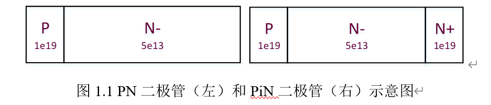
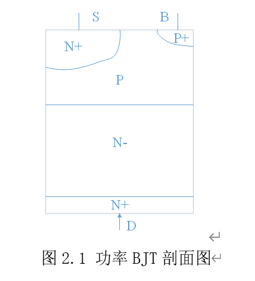
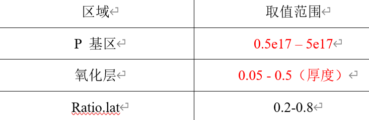
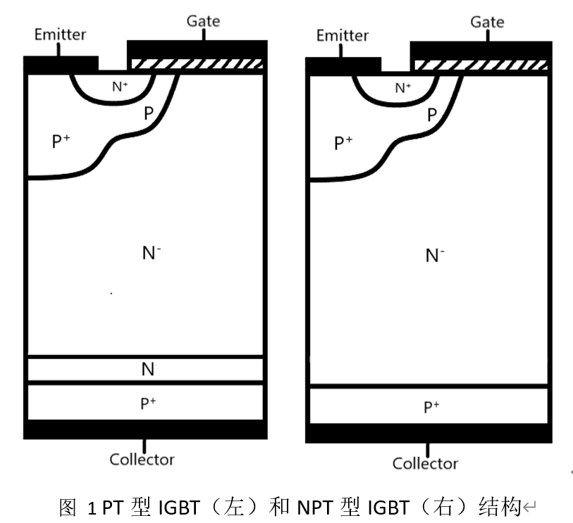

# 🚀Summary

---
## 🔍集成电路原理与设计

✨**S—Edit编辑逻辑电路图**
📖整体介绍    
使用S—Edit编辑基本元件符号（NMOS），设计简单逻辑电路（反相器）

✨**反相器的瞬时分析和直流特性分析**
📖整体介绍    
设置输入AC源电压，开启反相器的瞬时分析
设置输入AC源电压，开启反相器直流特性分析

✨**设计全加器电路**
📖整体介绍    
设计全加器电路图并进行瞬时分析

✨**设计两位二进制全加器**
📖整体介绍    
设计配置超前进位链的两位二进制全加器与两位二进制行波进位的并行全加器电路图    
分析瞬时特性和直流特性，比较电路的差异

---
## 🔍嵌入式系统设计：
✨**ARM汇编指令——基本数学/逻辑运算**
📖整体介绍    
使用LDR/STR和MOV等指令访问寄存器或存储单元，实现数据的加法运算。   
使用ADD/SUB/LSL/LSR/AND/ORR等指令，完成基本数学/逻辑运算。   

✨**ARM汇编指令——存储区数据块的传送** 
📖整体介绍    
设计并调试一个存储区数据块的传送程序，具体数据块的传送要求为：将数据从源数据区snum复制到目标数据区dnum，数据的个数num假定为20，复制时以8个字为单位进行，对于最后不足8个字的 数据，以字为单位进行复制。 

✨**汇编与C的相互调用——随机数发生器** 
📖整体介绍    
使用汇编语言设计一个产生随机数的函数，然后通过C语言来调用该函数产生一系列随机数，并存放到数组中。

✨**C组件应用实验——PWM直流电机控制**
📖整体介绍    
利用S3C2410X芯片的定时器0、1组成的双极性PWM发生器，设计一个实现嵌入式开发板/实验开发系统中的直流电动机驱动。

✨**嵌入式Linux系统开发**
📖整体介绍       
安装虚拟机，Linux操作系统，安装交叉编译器，Busybox，QT，配置与编译U-BOOT，Linux内核，构建及移植Linux开发环境。设计与调试一个温度转换，PWM电机组件控制的QT界面。

---
## 🔍电力电子技术仿真：

✨**AC-DC电路仿真**
📖整体介绍

✨**DC-AC电路仿真**
📖整体介绍

✨**AC-AC电路仿真**
📖整体介绍

✨**DC-DC电路仿真**
📖整体介绍

✨**Buck，PWM变换电路**
📖整体介绍

---

## 🔍数字信号处理：
✨**快速傅里叶及其应用**
📖整体介绍   
1.高斯序列的时域和幅频特性   
2.衰减正弦序列的时域和幅频特性    
3.三角波和反三角波序列的时域和幅频特性   
4.循环卷积和线性卷积   

✨**FIR数字滤波器的设计**
📖整体介绍   
1.矩形窗、汉明窗、布莱克曼窗的归一化的幅度谱      
2.汉宁窗设计线性相位带通滤波器   
3.矩形窗和布莱克曼窗设计线性相位带通滤波器   

---
## 🔍综合电子实训

✨**数控直流电压源**
📖整体介绍  
设计一款数显数调的直流稳压电源。输出电压0—15V，步进0.1V可调，误差≤0.05V；输出电流0—1000mA；
单片机模块能显示设定的电压值、输出的电压值和输出的电流值；能用“+、-”键步进调节输出电压值；
当输出电流达到1000mA时，由恒压输出模式改为恒流输出模式，即输出电流维持1000mA不变，输出电压降低。当输出电流小于1000mA时，自动恢复恒压输出的工作模式。

---
## 🔍功率半导体器件设计：

✨**二极管设计**
📖整体介绍         
设计器件，阻断电压为1200V，PiN的厚度设计为最薄，仿真得到正向导通特性和正向阻断特性     
   

✨**功率BJT设计**
📖整体介绍           
设计器件，阻断电压为300V，仿真得到正向导通特性和正向阻断特性   

✨**功率MOSFET设计**
📖整体介绍    
设计器件，阻断电压为600V，N-掺杂和厚度自定义，仿真得到正向导通特性和正向阻断特性  

✨**功率IGBT设计**
📖整体介绍      
完成1200V/10A NPT-IGBT与1200V/10A PT-IGBT结构参数的理论设计；
Silvaco-TCAD当中的建模，完成网格、材料、电极、掺杂和电学特性求解的语言描述；

---
## 🔍蓝桥杯嵌入式：

📖整体介绍   
Here are the source code PDFs of the 13th, 14th and 15th lanqiao, as well as my module configuration code.
|name       |                      |meaning        |    
|:--------  |:--------------------:|:-----------   | 
|14_x       |![alt text][finish]   |决赛           |   
|14_0_x     |![alt text][finish]   |省赛           |
|14_1/2/3x  |![alt text][finish]   |模拟题         |  
|15_x       |![alt text][todo ]    |15th-决赛      | 

[finish]: https://img.shields.io/badge/-finish-green "finish"
[todo]: https://img.shields.io/badge/-todo-orange "todo"

If you want to easily complete the 15th, I suggest you use the sscanf function and structure arrays or linked lists.

## 🔍立创EDA：

📖整体介绍   
I was responsible for sch design in the diansai, and learned and made a lot of circuits.I expanded the circuit diagram as a PDF and there is the official website of [立创EDA专业版](https://lceda.cn/) 

## 🔍Autodesk Fusion 3D：

📖整体介绍   
Autodesk Fusion connects your entire manufacturing process by integrating CAD, CAM, CAE, and PCB into a single solution allowing you to design and make anything.   
I use the Autodesk Fusion to design a belt and a wireless charging station.
there is the official website of [Autodesk Fusion](https://www.autodesk.com/products/fusion-360/overview?term=1-YEAR&tab=subscription) 

